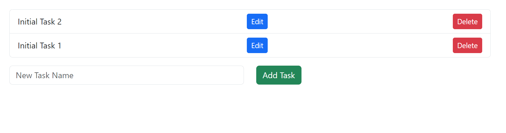

# Task Management Web Application

A simple Laravel-based web application designed to manage tasks efficiently. It features task creation, modification, deletion, and drag-and-drop reordering.


## Features

- **Create a Task**: Add a new task with a name and priority.
- **Edit a Task**: Update the name and priority of an existing task.
- **Delete a Task**: Remove a task from the list.
- **Reorder Tasks**: Drag and drop tasks to reorder them; the priority is automatically updated.

# Video Demo
[](https://www.youtube.com/watch?v=3QwfidvWyTo)

## Technical Stack

- **Backend**: Laravel (PHP)
- **Frontend**: Vue.js, Bootstrap for styling
- **Database**: MySQL
- **Development Environment**: Laravel Sail (Docker)

## Design Approach and Techniques
1. Repositories
   By employing the Repository Pattern, we have decoupled the application's business logic from the data access logic. This separation is evident in our TaskRepository where Laravel's Eloquent ORM is used for handling database operations like create, update, and delete actions. This layer acts as a mediator between the database and the service layer, enhancing the code's modularity and ease of maintenance.

2. Services
   The Service Layer is central to our application, embodying the core business logic. It interacts with the TaskRepository to perform data operations and encapsulates the specifics of these operations from the controllers. The TaskService, for instance, uses methods like createTask, updateTask, and deleteTask which internally call the repository methods, ensuring that controllers are lean and focused solely on handling HTTP requests and responses.

3. Data Transfer Objects (DTOs)
   To streamline the transfer of data within our application, especially between the HTTP layer and service layer, we've implemented Data Transfer Objects (DTOs) such as CreateTaskDTO, UpdateTaskDTO, and ReorderTasksDTO. These DTOs ensure that only valid data is passed to and from the service layer, adding an extra layer of data integrity and encapsulation. This pattern has helped simplify the method signatures in our services and has made the data manipulation processes more transparent and type-safe.

4. Request Validation
   We leverage Laravel's form request validation to validate the HTTP requests coming into our application. This is evident in our usage of custom request classes like CreateTaskRequest, UpdateTaskRequest, and ReorderTaskRequest. These classes abstract the validation logic away from the controllers, allowing us to maintain clean controllers that are free from cluttered validation logic and focus on handling business operations.

5. Vue.js and Draggable for Frontend Interactivity
   For the frontend, Vue.js is utilized to create a dynamic and responsive user interface that interacts with our Laravel backend via API calls. The integration of the Vue Draggable component allows us to implement a user-friendly drag-and-drop interface for task reordering. This seamless interaction between the frontend and backend is facilitated through Axios for making HTTP requests, demonstrating a modern approach to building interactive web applications.

6. MySQL Database
   The application's data persistence is managed using a MySQL database, with a schema that supports tasks and, optionally, projects. This relational database model is leveraged to ensure efficient storage and retrieval of task data, including their priorities.

## Installation & Setup

1. **Clone the Repository**

   ```bash
   git clone https://github.com/DispooL/task-managment-test.git
   cd task-management-laravel
   ```

2. **Install Dependencies**

   Run the following command to install the required PHP packages:

   ```bash
   composer install
   ```

   Then, install Node.js dependencies:

   ```bash
   npm install
   ```

3. **Environment Configuration**

   Copy the `.env.example` file to `.env` and configure your environment variables, particularly for the database.

   ```bash
   cp .env.example .env
   ```

4. **Generate App Key**

   ```bash
   php artisan key:generate
   ```

5. **Run Migrations**

   ```bash
   php artisan migrate
   ```

6. **Database Seeder (Optional)**

   To populate the database with some initial data, run:

   ```bash
   php artisan db:seed --class=TasksTableSeeder
   ```

7. **Start the Application with Laravel Sail**

   If you're using Laravel Sail (Docker), start the application using the following command:

   ```bash
   ./vendor/bin/sail up
   ```

   *Note: For first-time users, you might need to set up Docker and Sail according to the Laravel documentation.*

8. **Access the Application**

   Access the web application by visiting `http://localhost` in your web browser.

## Additional Information

- **Reordering Tasks**: To handle reordering on the frontend, Vue Draggable is used to provide an intuitive drag-and-drop interface.
- **Backend Logic**: Tasks are automatically reprioritized upon reordering to maintain sequential priorities.
- **API Endpoints**: Use RESTful API endpoints for managing tasks (`/api/tasks`) and reordering them (`/api/tasks/reorder`).

## Tests

Tests can be executed by running

 ```bash
    php artisan test
   ```

## Conclusion

This task management application leverages Laravel's framework capabilities alongside Vue.js to provide a dynamic and responsive user interface. By using functionality in Services and DTOs, the code maintains clear separation of concerns and high readability. It's designed to be scalable and easily extendable for future enhancements such as adding user authentication or integrating with external APIs for enhanced project management capabilities.
